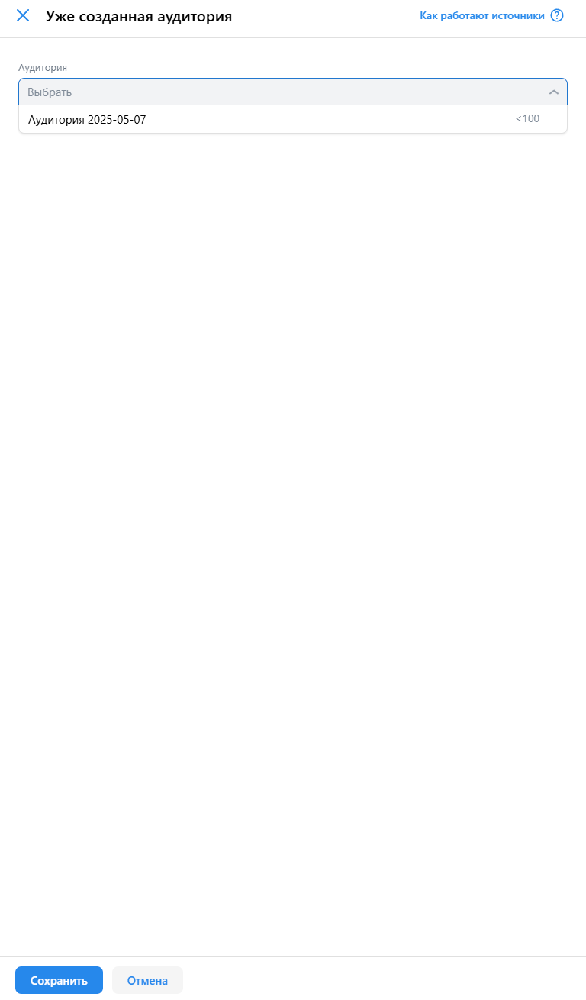
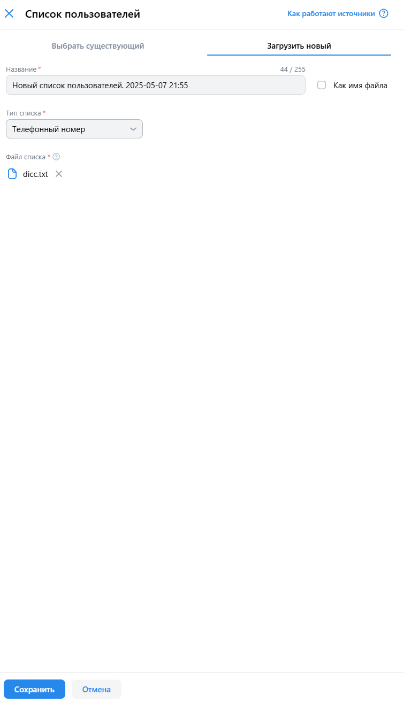

# 1/4 чек-листа команды Fight Club для сайта [ads.vk.com](ads.vk.com)

---

## Содержание

- [Аудитории](#Аудитории)
- [Компании](#Компании)

---

## Аудитории

URL: https://ads.vk.com/hq/audience

### Аудитории. Создание

- Создание аудитории. При нажатии на кнопку "Создать аудиторию" справа открывается боковое меню "Cоздания аудитории"
- Создании аудитории. При нажатии вне меню, оно закрывается
- Создании аудитории. При нажатии на кнопку "Отмена", меню закрывается
- Создание аудитории. При выборе типа примения условий появляется выпадающий список условий
    - всем условиям
    - хотя бы одному из условий
    - ни одному из условий

- Источник аудитории. Список пользователей. Выбрать существующий. При вводе названия списка появляется выпадающие меню со всеми доступными списками
- Источник аудитории. Список пользователей. Загрузить новый. При нажатии на чекбокс "Как имя файла" поле "Название" становиться неактивным
- Источник аудитории. Список пользователей. Загрузить новый. При нажатии на "Тип списка" появляются предлогаемые варианты
- Источник аудитории. Список пользователей. Загрузить новый. При нажатии на "Файл списка" открывается проводник для загрузки файла

- Источник аудитории. Ключевые фразы. При вводе фразы появляется кнопка "Показать 10 похожих".
- Источник аудитории. Ключевые фразы. При нажатии на кнопку "Показать 10 похожих" открывается выпадающий список с похожими фразами
- Источник аудитории. Ключевые фразы. После нажатия на кнопку "Сохранить" он появляется в списках создаваемой аудитории

- Источник аудитории. Подписчик сообществ. После ввода названия в выпадающим списке отображаются найденные сообщества
- Источник аудитории. Подписчик сообществ. После сохранения он появляется в списках создаваемой аудитории

- Источник аудитории. Музыканты. После ввода имени в выпадающием списке отображаются найденные музыканты
- Источник аудитории. Музыканты. После сохранения он появляется в списках создаваемой аудитории

### Аудитории. Список аудиторий

- Сортировка. Сортировка по названию меняет порядок аудиторий на алфавитный
- Сортировка. Сортировка по дате создания меняет порядок аудиторий по дате создания
- Сортировка. Сортировка по ID аудитории меняет порядок аудторий по ID

- Фильтры. При выборе источника аудитории в списке аудиторий остаются только те аудитории, в которых присутствует выбранный фильтр

- Редактирование. После изменения данных аудитории она обновляется в списке
- Редактирование. При клике вне окна редактирования аудитории отображается модальное окно "Прервать редактирование?"
- Редактирование. При прерывании редактирования аудитории она не меняется в списке

- Удаление. После удаления аудитории она пропадает из списка

### Список пользователей. Создание

- При нажатии на кнопку "Как имя файла" поле "Название" становится неактивным
- При нажатии на "Тип списка" появляются предлогаемые варианты
- При нажатии на "Файл списка" открывается проводник для загрузки файла

### Компании

URL: https://ads.vk.com/hq/dashboard/ad_plans

- Кампании. Создание кампании. Настройка кампании. Целевые действия. Сайт. Ошибка "Обязательное поле" при незаполненной ссылке на сайт
- Кампании. Создание кампании. Настройка кампании. Целевые действия. Сообщество и профиль. При клике по "Рекламируемый объект" открывается выпадающий список со всеми доступными для выбора сообществами
- Кампании. Создание кампании. Настройка кампании. Узнаваемость и охват. Баннерная реклама. Сайт. Ошибка "Обязательное поле" при незаполненной ссылке на сайт.
- Кампании. Создание кампании. Настройка кампании. Узнаваемость и охват. Баннерная реклама. Сайт. Ошибка "Обязательное поле" при незаполненной ссылке на сайт.
- Кампании. Создание кампании. Настройка кампании. Узнаваемость и охват. Баннерная реклама. Сайт. Ошибка "Укажите бюджет не меньше 100₽" при указанном бюджете меньше 100 рубелей.
- Кампании. Создание кампании. Группы объявлений. Регионы показа. При наборе символов в поле "Страна, регион или город" отображаются предлагаемые варианты
- Кампании. Создание кампании. Группы объявлений. Интересы и поведение. При наборе символов в поле "Интересы" отображаются предлагаемые варианты
- Кампании. Создание кампании. Объявления. Ошибка "Обязательное поле" при незаполненном заголовке
- Кампании. Создание кампании. Объявления. Ошибка "Обязательное поле" при незаполненном описании
- Кампании. Список кампаний. Отображаются созданные кампании.
- Кампании. Список кампаний. Кампании фильтруются по названию.